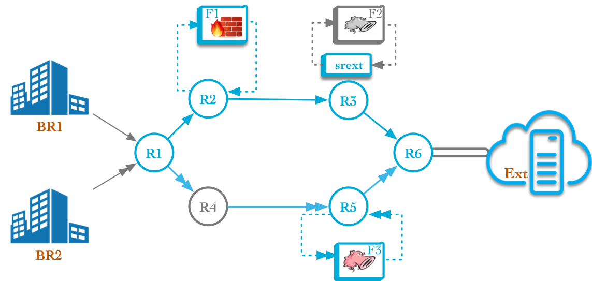

# Chaining of SR-aware and SR-unaware Service Functions

## Abstract   
Segment Routing (SR) is a source routing paradigm that can benefit from both MPLS and IPv6 data planes to steer traffic through a set of nodes. It provides a simple and scalable way to support Service Function Chaining (SFC). In this demo, we propose an NFV architecture based on SR and implemented in Linux environment. It allows chaining of both SR-aware and SR-unaware Service Functions (SFs). In order to include SR-unaware SFs into SR SFC, we use our SR proxy implementation: [srext](https://github.com/SRouting/SRv6-net-prog), a Linux kernel module that handles the processing of SR information in behalf of the SR-unaware SFs. As SR-aware SFs, we use two of our implementation; [SERA](https://github.com/SRouting/SERA) and [SR-aware snort](https://github.com/SRouting/SR-snort). SERA is a SEgment Routing Aware Firewall, which extends the Linux iptables firewall, and capable of applying the iptables rules to the inner packet of SR encapsulated traffic. SR-aware snort is an extended version of snort that can apply snort rules directly to inner packet of SR encapsulated traffic. We show the interoperability between SR-aware and SR-unaware SFs by including both of them within the same SFC.

## Description  
A full description of the demo is available [here](https://github.com/SRouting/SR-sfc-demo/blob/master/docs/chaining-of-sr-aware-and-sr-unaware-sf.pdf). 

## Topology 
The topology used for the demo is as shown below:



## Setup 
Before starting, please make sure that you have [vagrant](https://www.vagrantup.com/downloads.html) and 
[virtualbox](https://www.virtualbox.org/wiki/Downloads) installed on your machine.

Clone the git repository in your machine: 

```
$ git clone https://github.com/SRouting/SR-sfc-demo
```

Start the testbed:

```
$ cd SR-sfc-demo/
$ vagrant up 
```

It takes a bit of time, please be patient .......

Now we have the testbed running with all required configuration. 

## Testing 
The testbed supports two different path, with different bandwidth and security guarantees, towards *Ext*. 

* Path p1 (R1 → R4 → R5 → R6) provides high bandwidth. 
* Path p2 (R1 → R2 → R3 → R6) has lower bandwidth, but more security guarantees. 

> Going through p1 implies crossing F1 and F2. Likewise, going through p2 implies crossing F3. 

BR1 and BR2 have different traffic requirements; BR2 traffic is very delay-sensitive, while BR1 traffic is highly confidential, but less delay sensitive. 

We exploit p1 and p2 to satisfy those traffic requirements. BR1 traffic is steered through p1, and BR2 traffic is steered through p2. 

At the ingress node (R1), we configured two different SR SFC policies (CP1 and CP2) that steer traffic through p1 and p1. Policy Based Routing (PBR) is used to classify traffic coming from BR1 and BR2, which respectively go through CP1 and CP2.

### BR1 traffic 

BR1 traffic should follow the path BR1 → R1 → R2 → F1 → R3 → F2 → R6 → *Ext*.

In the next steps, we show configuration of all nodes along the path of BR1 traffic. 

**BR1**

BR1 and BR2 are deployed as Linux network namespaces inside R1. 
```
$ vagrant ssh r1 
$ ip netns
br2 (id: 1)
br1 (id: 0)
```

BR1 is used to generate traffic towards *Ext*, which will be classified at R1 and accordingly steered through the configured SRv6 SFC policy. 
```
$ vagrant ssh r1 
$ ip netns exec br1 bash
$ ping6 fc00:e::
PING fc00:e::(fc00:e::) 56 data bytes
64 bytes from fc00:e::: icmp_seq=1 ttl=61 time=2.34 ms
64 bytes from fc00:e::: icmp_seq=2 ttl=61 time=2.98 ms
```

**R1**

R1 serves as the ingress node of our SRv6 based SFC scenario. 

It is configured with Policy Based Routing (PBR) and SFC policies that force BR1 and BR2 traffic to respectively follow paths P1 and P2.
```
$ vagrant ssh r1 

$ ip -6 rule
.....
32764:	from fc00:b2::/64 lookup br2
32765:	from fc00:b1::/64 lookup br1
.....

$ ip -6 route show table br1
fc00:e::/64 encap seg6 mode encap segs 3 [ fc00:2::f1:0 fc00:3::f2:ad60 fc00:6::d6 ] dev eth1

$ ip -6 route show table br2
fc00:e::/64 encap seg6 mode encap segs 2 [ fc00:5::f3:0 fc00:6::d6 ] dev eth2

$ tcpdump -i eth1
.....
IP6 fc00:b1::1 > fc00:2::f1:0: srcrt (len=6, type=4, segleft=2, last-entry=2, tag=0, [0]fc00:6::d6,
[1]fc00:3::f2:ad60, [2]fc00:2::f1:0) IP6 fc00:b1::2 > fc00:e::: ICMP6, echo request, seq 1, length 64
.....

$ tcpdump -i eth2
.....
IP6 fc00:b2::1 > fc00:5::f3:0: srcrt (len=4, type=4, segleft=1, last-entry=1, tag=0, [0]fc00:6::d6,
[1]fc00:5::f3:0) IP6 fc00:b2::2 > fc00:e::: ICMP6, echo request, seq 9, length 64
.....
```

**R2**

R2 is an NFV node, which has F1 (SERA) deployed as Linux network namespace. 

```
$ vagrant ssh r2
$ ip netns
f1 (id: 0)
```

**F1**

F1 is running SERA (SEgment Routing Aware Firewall), which extends the Linux iptables firewall, and capable of applying the iptables rules to the inner packet of SR encapsulated traffic. 

SERA supports a per namespace sysctl, named *ip6t_seg6*, that enables/disables the SR capabilities. 

Traffic going through F2 is SR encapsulated, but you still can write default iptables rules, and SERA will apply them directly to inner packets. 

>The ip6t_seg6 has to be set to 1 

```
$ vagrant ssh r2
$ ip netns exec f1 bash 

$ tcpdump -i veth0-f1
.....
IP6 fc00:b1::1 > fc00:2::f1:0: srcrt (len=6, type=4, segleft=2, last-entry=2, tag=0, [0]fc00:6::d6,
[1]fc00:3::f2:ad60, [2]fc00:2::f1:0) IP6 fc00:b1::2 > fc00:e::: ICMP6, echo request, seq 1386, length 64
.....

$ sysctl -w net.ipv6.ip6t_seg6=1
net.ipv6.ip6t_seg6 = 1

$ ip6tables -I INPUT --source fc00:b1::/64 --destination fc00:e::/64 --protocol icmpv6 -j DROP

$ ip6tables -L -nvx
Chain INPUT (policy ACCEPT 3 packets, 208 bytes)
    pkts    bytes   target     prot    opt in     out       source            destination
     28      2912    DROP      icmpv6       *      *      fc00:b1::/64        fc00:e::/64
```

Don't forget to remove the rule to let the traffic pass through
```
$ ip6tables -F
```


**R3**

R3 is another NFV node that host F2 (SR-unware snort) deployed as Linux network namespace. 

We use srext (SR proxy) to remove SR encapsulation from packets before being handed to F2. The removed SR encapsulation is re-added again to packets after being processed. 

```
$ vagrant ssh r3
$ ip netns
f2 (id: 0)

$ srconf localsid show
SRv6 - MY LOCALSID TABLE:
==================================================
	 SID     :        fc00:3::f2:ad60
	 Behavior:        end.ad6
	 Next hop:        fd00:3::f2:2
	 OIF     :        veth0
	 IIF     :        veth1
	 Good traffic:    [13048 packets : 1354928  bytes]
	 Bad traffic:     [18 packets : 3168  bytes]
------------------------------------------------------

$ tcpdump -i eth1
.....
IP6 fc00:b1::1 > fc00:3::f2:ad60: srcrt (len=6, type=4, segleft=1, last-entry=2, tag=0, [0]fc00:6::d6,
[1]fc00:3::f2:ad60, [2]fc00:2::f1:0) IP6 fc00:b1::2 > fc00:e::: ICMP6, echo request, seq 3090, length 64
.....

$ tcpdump -i veth0
.....
IP6 fc00:b1::2 > fc00:e::: ICMP6, echo request, seq 3037, length 64
.....

$ tcpdump -i veth1
.....
IP6 fc00:b1::2 > fc00:e::: ICMP6, echo request, seq 3037, length 64
.....

$ tcpdump -i eth2
.....
IP6 fc00:b1::1 > fc00:6::d6: srcrt (len=6, type=4, segleft=0, last-entry=2, tag=0, [0]fc00:6::d6,
[1]fc00:3::f2:ad60, [2]fc00:2::f1:0) IP6 fc00:b1::2 > fc00:e::: ICMP6, echo request, seq 3152, length 64
.....
```

**F2**
F1 is running SR-unaware snort. It receives packets without SR encapsulation and apply the snort rules to them. 

We configured snort with a rule that alert on ICMP packets 

```
$ vagrant ssh r3
$ ip netns exec f2 bash 

$ cat /etc/snort/rules/local.rule
alert icmp any any -> any any (msg:"ICMP detected"; sid:1000)

$ snort -c /etc/snort/snort.conf -A console
.....
[**] [1:1000:0] ICMP detected [**] [Priority: 0] {IPV6-ICMP} fc00:b1::2 -> fc00:e::
.....
```

**R6**
R6 serves as the egress node, where SR encapsulation is removed from packets before leaving the SR domain. 

It is also configured with Policy Based Routing (PBR) and SFC policies to make sure that BR1 and BR2 traffic follows the exact path in both upstream and downstream. 
This guarantees that SFs get the traffic in both directions.

It implements the external network (*Ext*) as a Linux network namespace. 

```
$ vagrant ssh r6

$ ip netns
ext (id: 0)

$ tcpdump -i eth1
.....
IP6 fc00:b1::1 > fc00:6::d6: srcrt (len=6, type=4, segleft=0, last-entry=2, tag=0, [0]fc00:6::d6,
[1]fc00:3::f2:ad60, [2]fc00:2::f1:0) IP6 fc00:b1::2 > fc00:e::: ICMP6, echo request, seq 6733, length 64
.....

$ tcpdump -i veth1
.....
IP6 fc00:b1::2 > fc00:e::: ICMP6, echo request, seq 19, length 64
.....

$ ip -6 rule
.....
32765:	from fc00:e::/64 lookup localsid
.....

$ ip -6 route show table localsid
fc00:b1::/64  encap seg6 mode encap segs 3 [ fc00:3::f2:ad61 fc00:2::f1:0 fc00:1::d6 ] dev eth1 
fc00:b2::/64  encap seg6 mode encap segs 2 [ fc00:5::f3:0 fc00:1::d6 ] dev eth2
```

**Ext**

The *Ext* network here serves as a traffic sink. 

### BR2 traffic 

BR2 traffic should follow the path BR2 → R1 → R4 → R5 → F3 → R6 → *Ext*.

Likewise, we can show configuration of all nodes along the path of BR2 traffic. However, you focus only on F3 since the rest are similar to what we have shown for BR1. 

**F3**

F3 is running an SR-aware snort, which is an extended version of snort that can apply snort rules directly to inner packet of SR encapsulated traffic.

SR-aware snort receives SR encapsulated packets, but still able apply the configured snort rules to inner packets. 

```
$ vagrant ssh r5
$ ip netns
f3 (id: 0)

$ ip netns exec f3 bash 

$ tcpdump -i veth0-f3
.....
IP6 fc00:b2::1 > fc00:5::f3:0: srcrt (len=4, type=4, segleft=1, last-entry=1, tag=0, [0]fc00:6::d6,
[1]fc00:5::f3:0) IP6 fc00:b2::2 > fc00:e::: ICMP6, echo request, seq 72, length 64

$ cat /etc/snort/rules/local.rule
alert icmp any any -> any any (msg:"ICMP detected"; sid:1000)

$ snort -c /etc/snort/snort.conf -A console
.....
[**] [1:1000:0] ICMP detected [**] [Priority: 0] {IPV6-ICMP} fc00:b2::2 -> fc00:e::
.....
```

### Useful links

* [SRext](https://github.com/SRouting/SRv6-net-prog) - a Linux kernel module that implements different SR proxy behaviours. 
* [SERA](https://github.com/SRouting/SERA)  - a SEgment Routing Aware Firewall.
* [SR-iptables](https://github.com/SRouting/SR-iptables) - an extended version of iptables userspace utility that allows adding SR-aware iptables rules.
* [SR-snort](https://github.com/SRouting/SR-snort) - an SR-aware version of snort. 
* [SR-tcpdump](https://github.com/SRouting/SR-tcpdump) - an SR-extended version of tcpdump able to parse SRH information. 
